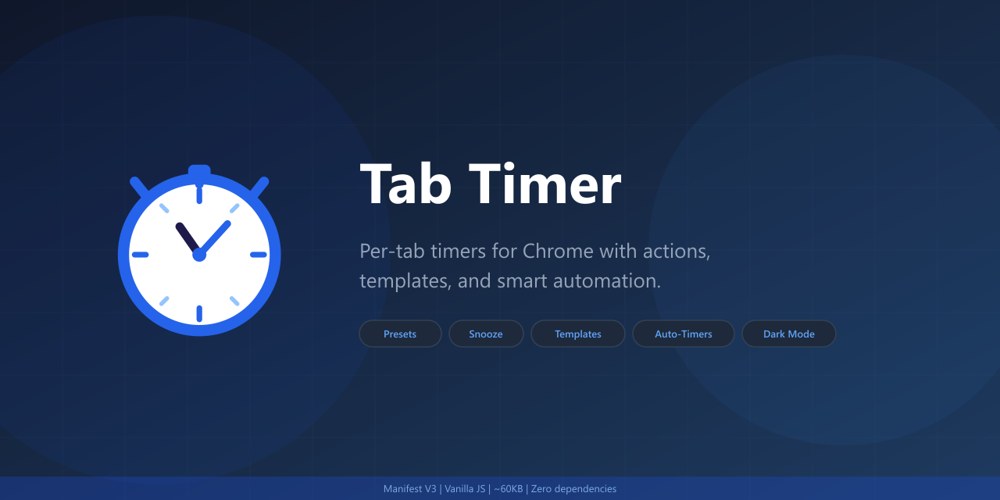
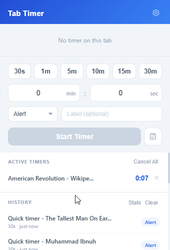
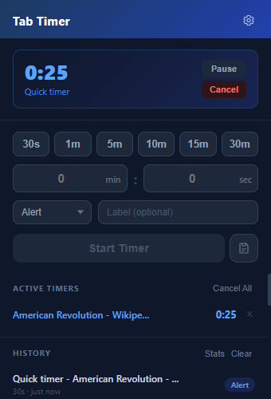

# Tab Timer

A lightweight Chrome extension for per-tab timers with configurable completion actions. Vanilla JS, ~60KB built.

<p align="center">
  
</p>

<p align="center">
  
  &nbsp;&nbsp;
  
</p>

## Features

### Timer Controls
- **Quick presets** - 30s, 1m, 5m, 10m, 15m, 30m (customizable in settings)
- **Custom duration** - any minutes + seconds combination
- **Per-tab timers** - each tab gets its own independent timer
- **Pause / Resume**
- **Optional labels** - add a note to remember what the timer is for
- **Cancel all** - clear every active timer at once
- **Tab group support** - set the same timer on all tabs in a Chrome tab group

### Completion Actions
- **Alert** - desktop notification
- **Close tab** - automatically close the tab
- **Reload tab** - refresh the page
- **Mute tab** - mute the tab's audio
- **Focus tab** - bring the tab to front

### Indicators
- **Live countdown in tab title** - remaining time shows directly in the browser tab (e.g. `4m30s | Page Title`), ticks every second
- **Badge indicator** - remaining time on the extension icon
- **Sticky notifications** - stay until dismissed, click to focus the tab
- **Sound alert** - three-tone chime via Web Audio API
- **Alert on tab close** - optional notification when a tab with an active timer is closed

### Quick Access
- **Keyboard shortcuts** - `Alt+T` opens popup, `Alt+Shift+T` starts a quick timer on the current tab
- **Right-click context menu** - preset durations and cancel options directly from any page
- **Snooze** - notification button to restart the timer (configurable duration)

### Templates
- Save timer configs as named templates for one-click reuse
- Show as chips at the top of the popup
- Right-click to delete

### URL Auto-Timers
- Regex patterns in settings to auto-start timers on matching URLs
- Each rule has its own duration, action, and enable toggle
- Useful for time-limiting social media or other sites

### Stats
- Timer usage statistics from the history section
- Total timers, total time, average duration, active days
- Bar charts by action type and last 7 days

### Other
- **Timer history** - completed timers with tab name, duration, action, and timestamp (up to 200 entries)
- **Settings page** - presets, actions, sound, notifications, tab title, snooze, and more
- **Theme** - light, dark, or system
- **Export / Import** - settings, templates, and URL rules as JSON
- **Persists across restarts** - timers survive browser restarts
- **Auto-cleanup** - orphaned timers from closed tabs get removed

## Install

```bash
npm install
npm run build
```

1. Open `chrome://extensions`
2. Enable **Developer mode** (top right)
3. Click **Load unpacked**
4. Select the `dist/` folder

### Development

```bash
npm run dev
```

Watches for file changes and rebuilds automatically.

## Keyboard Shortcuts

| Shortcut | Action |
|---|---|
| `Alt+T` | Open the Tab Timer popup |
| `Alt+Shift+T` | Quick timer on current tab (first preset, default action) |

Customizable at `chrome://extensions/shortcuts`.

## Architecture

| Layer | Tech | Why |
|---|---|---|
| Extension | Manifest V3 | Required for new Chrome extensions |
| Background | Service worker | Suspends when idle |
| Timers (>1min) | `chrome.alarms` | OS-level scheduling, zero CPU while waiting |
| Timers (<1min) | `setTimeout` | Alarms have a ~1min minimum delay |
| Sound | Offscreen document + Web Audio API | Service workers can't play audio directly |
| Tab title | `chrome.scripting.executeScript` | Injects a 1s interval for live countdown |
| UI | Vanilla JS + CSS | Zero runtime dependencies |
| Build | esbuild | ~30ms builds |
| Icons | SVG + sharp | PNG generation at 16/48/128px |

## Project Structure

```
chrome-tab-timer/
├── src/
│   ├── background.js      # Service worker: timers, alarms, actions, badge, tab title,
│   │                      # context menus, URL rules, templates, snooze, stats
│   ├── popup.html
│   ├── popup.css           # Inlined during build
│   ├── popup.js
│   ├── options.html
│   ├── options.css         # Inlined during build
│   ├── options.js
│   ├── offscreen.html      # Audio playback document
│   ├── offscreen.js
│   └── icons/
│       ├── icon.svg        # Source
│       ├── icon16.png
│       ├── icon48.png
│       └── icon128.png
├── manifest.json
├── build.js
├── generate-icons.js
├── package.json
└── dist/                   # Built extension (git-ignored)
```

## Permissions

| Permission | Why |
|---|---|
| `alarms` | Timer scheduling |
| `storage` | Persist timers, history, templates, URL rules, settings |
| `notifications` | Desktop notifications on completion |
| `tabs` | Read tab titles, close/reload/mute/focus tabs |
| `tabGroups` | Set timers on tab groups |
| `offscreen` | Play notification sound |
| `scripting` | Tab title countdown injection |
| `contextMenus` | Right-click menu |
| `<all_urls>` | Required by scripting API to inject into any tab |

## License

MIT
